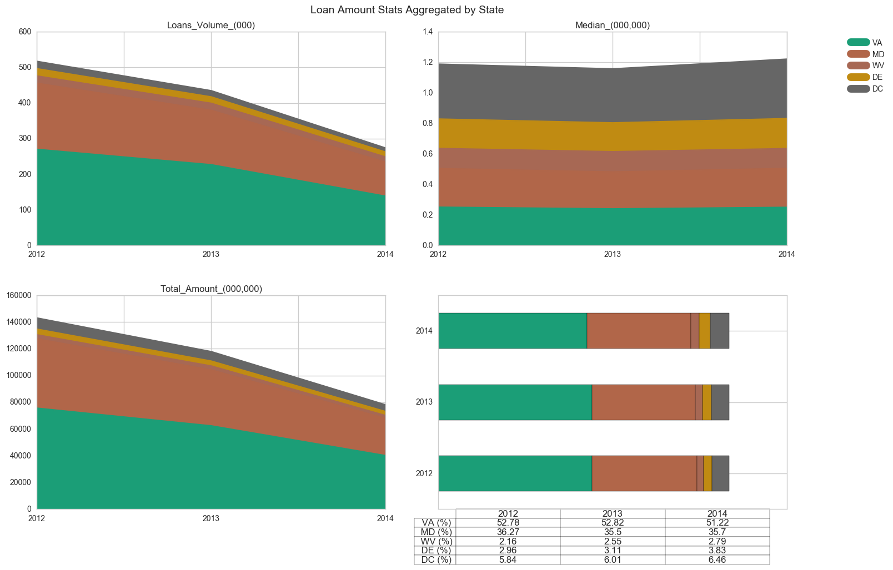
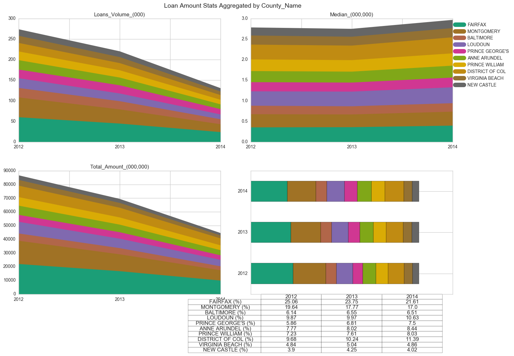
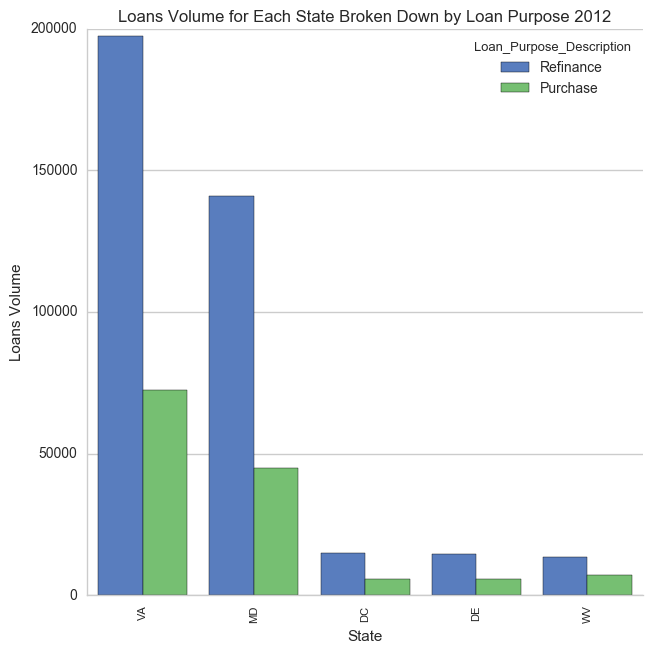
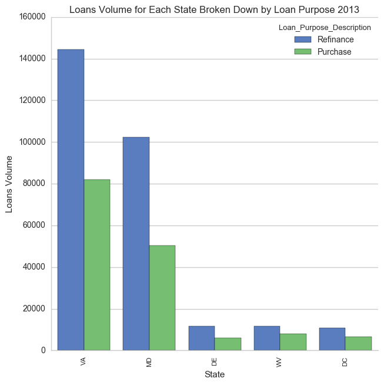
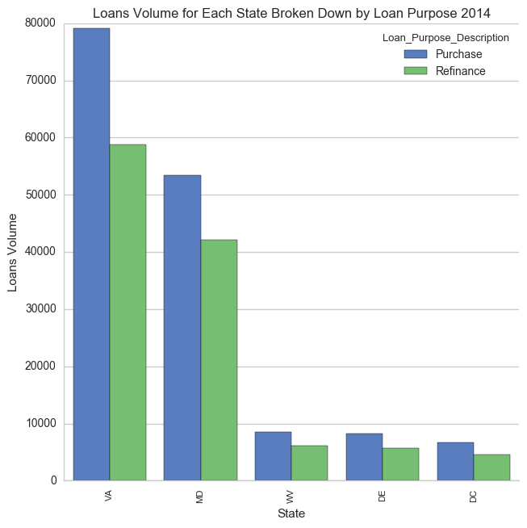
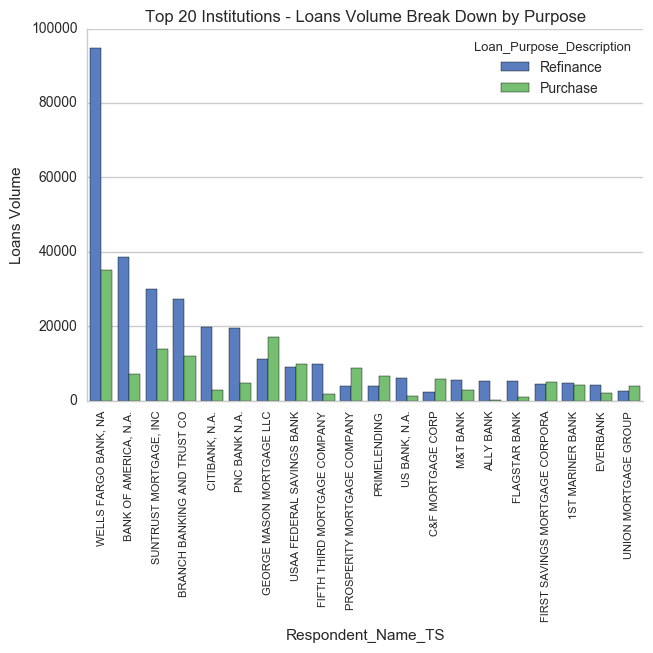

# HDMA Data Challenge

>This challenge consist of analysis of Home Mortage Disclosure Act(HMDA) data set collected and published each year which consist of data of home loan applicatons received by lenders across the US

## Problem Statement 
*Change Financial, a small regional bank wants to grow and enter home loan market.It wants to know if entering the loans market is strageic move , Being an information driven culture they first want to understand their region's home lending market*.


## Data


*I have used Input method to store data where user can give the path of working directory.The reason for using this way to avoid conflict in the way we give path in Mac OS by single "/" and in windows "//"*
 

```
dirname=input("Enter the current working directory")
os.chdir(dirname)# Set current working directory
os.getcwd() # Get current working directory

```

*I have Created a configuaration file which stores all the configuartion details as Api Key ,dates, password etc . We need to use parser to fetch configuration file*

```
from configparser import ConfigParser
config = ConfigParser()

path='config/settings.cfg'
config_file = os.path.abspath(path)
config.read(config_file)
```


The following data are used for the analysis (as obtained from the metadata included with the source data files)

### Metadata

<table>
  <thead>
    <tr><th>Data file(s)</th><th>Description</th></tr>
  </thead>
  <tbody>
    <tr>
      <td>2012_to_2014_loans_data.csv</td>
      <td>Data on home loans originated within the states where Change Financial Operates.</td>
    </tr>
    <tr>
      <td>2012_to_2014_institutions_data.csv</td>
      <td>Data about the originating institutions as submitted by the institutions themselves</td>
    </tr>
  </tbody>
</table>

Here is the schema of the expanded loans data.

<table style="height: 477px;" width="315">
  <thead>
    <tr><th>Field</th><th>Type</th></tr>
  </thead>
  <tbody>
    <tr>
      <td>As_of_Year</td>
      <td>integer</td>
    </tr>
    <tr>
      <td>Agency_Code</td>
      <td>integer</td>
    </tr>
    <tr>
      <td>Agency_Code_Description</td>
      <td>string</td>
    </tr>
    <tr>
      <td>Respondent_ID</td>
      <td>string</td>
    </tr>
    <tr>
      <td>Sequence_Number</td>
      <td>integer</td>
    </tr>
    <tr>
      <td>Loan_Amount_000</td>
      <td>integer</td>
    </tr>
    <tr>
      <td>Applicant_Income_000</td>
      <td>integer</td>
    </tr>
    <tr>
      <td>Loan_Purpose_Description</td>
      <td>string</td>
    </tr>
    <tr>
      <td>Loan_Type_Description</td>
      <td>string</td>
    </tr>
    <tr>
      <td>Lien_Status_Description</td>
      <td>string</td>
    </tr>
    <tr>
      <td>State_Code</td>
      <td>integer</td>
    </tr>
    <tr>
      <td>State</td>
      <td>string</td>
    </tr>
    <tr>
      <td>County_Code</td>
      <td>integer</td>
    </tr>
    <tr>
      <td>MSA_MD</td>
      <td>integer</td>
    </tr>
    <tr>
      <td>MSA_MD_Description</td>
      <td>string</td>
    </tr>
    <tr>
      <td>Census_Tract_Number</td>
      <td>integer</td>
    </tr>
    <tr>
      <td>FFIEC_Median_Family_Income</td>
      <td>integer</td>
    </tr>
    <tr>
      <td>Tract_to_MSA_MD_Income_Pct</td>
      <td>integer</td>
    </tr>
    <tr>
      <td>Number_of_Owner_Occupied_Units</td>
      <td>integer</td>
    </tr>
    <tr>
      <td>County_Name</td>
      <td>integer</td>
    </tr>
    <tr>
      <td>Conforming_Limit_000</td>
      <td>integer</td>
    </tr>
    <tr>
      <td>Conventional_Status</td>
      <td>string</td>
    </tr>
    <tr>
      <td>Conforming_Status</td>
      <td>string</td>
    </tr>
    <tr>
      <td>Conventional_Conforming_Flag</td>
      <td>string</td>
    </tr>
    <tr>
      <td>Respondent_Name_TS</td>
      <td>string</td>
    </tr>
  </tbody>
</table>


## Data Munging


This will get the data loaded, left join loans data with institutions then create a loan_bucket categorical variable then dump a json version of the expanded data in directory. 

To run the data munging run following notebook

``` CapitalOne.ipynb ```

This will create a new json file in the `./data` directory that contains the merged loan and institution data and additional column (loan_amount_bucket)


### Data Quality

This will perform quality assessment and generate report for missing values for the selected variables, duplicate records and outliers (using _Median Absolute Deviation_ method). Quality reporting is currently available for two columns in the expanded dataset (_Respondent_Name_TS_ and _Loan_Amount_000_)


To run the data munging run following notebook

``` CapitalOne.ipynb ```

The module will provide a summary of the quality issues for the day and export records with data quality issues in different files according to the issue type

## Analysis


**Can Change Financial enter the home loan market?.**


**Result**



```
Explanation: We can see that Between 2012-2014 the number of loans including Delaware, Virginia, West Virginia and Maryland has significantly decreased including district of Columbia although the decline varies from state to state. Over the past 3 years the largest number of loans originated in Virginia followed by Maryland. The no of loans in Virginia is around 54 percent followed by 33 percent in Maryland.

Result: We can see close to 89 percent of loans of home loans is concentrated in Virginia and Maryland, Since Change Financial planning to enter home loan market in District of Columbia where is loan is not much concentrated we need to dig further weather there is concentration of loans in counties and metropolitan within states to see if it is best to strictly focus on the top markets at this point.


```


** Understanding Conventional/Conforming market and which type is better? **


** Result **





```
Explanation: The above graph displays purpose of loans i.e. refinancing or purchasing. We can see that refinancing existing loan are relatively less risky as compared of purchasing loans

Result: We can see their is significant no of loan is of refinancing and they are less risky and less in amount than purchasing loan
```


** Key institutions in market and their on analysis on loan market types? **


** Result **



```
Explanation: From above graph it is evident that the highest market share prefer to extend refinance loans than new loans for a purchase of a home supporting our decision to target refinance loans.


Result: We can see from our analysis that existing lending institutions refinance loans in significantly high rates than new loans for purchase of a home. Yet, it it apparent that if we believe it is a good idea to emulate the lending patterns of institutions with the largest market share, then it means Change Financial would lend greatly more in refinance loans in the largest markets.


```
