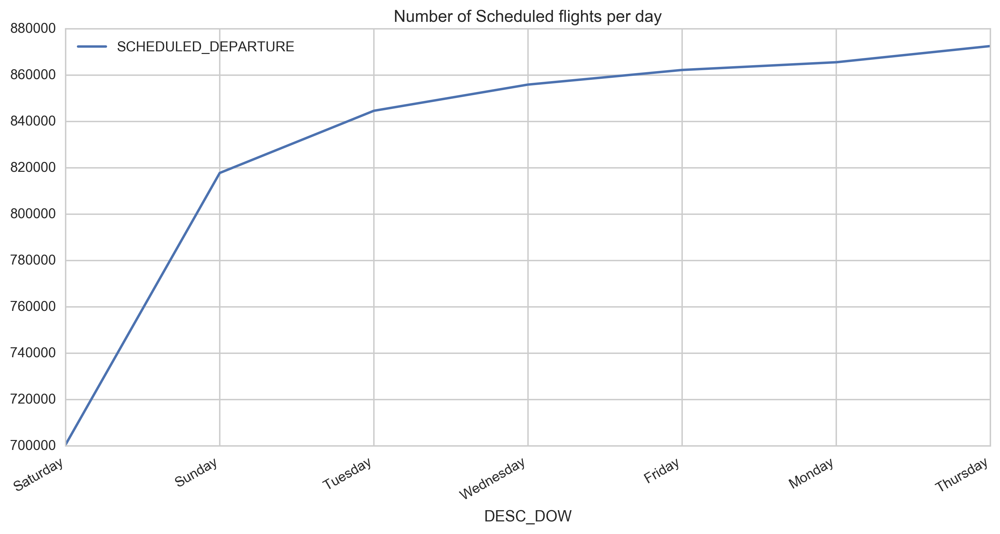

# Final Exam - Spring 2017

>This Assignment consist of analysis on following dataset
- Flight Delay Dataset.

   
## Flight Data Set 


- The flight data-set is available at [Flight  Prediction data 400 MB files](https://www.kaggle.com/usdot/flight-delays) .

##Context

*The U.S. Department of Transportation's (DOT) Bureau of Transportation Statistics tracks the on-time performance of domestic flights operated by large air carriers. Summary information on the number of on-time, delayed, canceled, and diverted flights is published in DOT's monthly Air Travel Consumer Report and in this dataset of flight delays and cancellations*


## Folder Structure


### Meta Data & Relationship

<table>
  <thead>
    <tr><th>Data file(s)</th><th>Description</th></tr>
  </thead>
  <tbody>
    <tr>
      <td>flights.csv</td>
      <td>Data consist of around 480k flights with original_airport & destination_airport.</td>
    </tr>
    <tr>
      <td>airports.csv</td>
      <td>Data consist of airport information as city,state,latitude and longitude along with IATA airport codes and names</td>
    </tr>
    <tr>
      <td>airlines.csv</td>
      <td>Data consist of IATA airline codes and airlines names.</td>
    </tr>
  </tbody>
</table>


> The following times are in the xx:yy - hour:minute format (e.g. 1536 means 3:36pm, 345 means 3:45am, 16 means 00:16am)

<table>
  <thead>
    <tr><th>Field</th></tr>
  </thead>
  <tbody>
    <tr>
      <td>arrival_delay</td>
    </tr>
    <tr>
      <td>departure_delay</td>
    </tr>
    <tr>
      <td>scheduled_arrival</td>
    </tr>
    <tr>
      <td>arrival_time</td>
    </tr>
    <tr>
      <td>wheels_off</td>
    </tr>
    <tr>
      <td>wheels_on</td>
    </tr>
</tbody>
</table>

> The following times are in minutes format (negatives mean actual_time is ahead of scheduled_time for the absolute value of that negative number)

<table>
  <thead>
    <tr><th>Field</th></tr>
  </thead>
  <tbody>
    <tr>
      <td>arrival_delay</td>
    </tr>
    <tr>
      <td>taxi_in</td>
    </tr>
    <tr>
      <td>taxi_out</td>
    </tr>
    <tr>
      <td>scheduled_time</td>
    </tr>
    <tr>
      <td>elapsed_time</td>
    </tr>
    <tr>
      <td>air_time</td>
    </tr>
    <tr>
      <td>- Distance in miles</td>
    </tr>
</tbody>
</table>


> Data Definition

<table>
  <thead>
    <tr><th>Field</th><th>Defination</th></tr>
  </thead>
  <tbody>
    <tr>
      <td>WHEELS_OFF Time</td>
      <td>The time point that the aircraft's wheels leave the ground.</td>
    </tr>
    <tr>
      <td>WHEELS_ON Time</td>
      <td>The time point that the aircraft's wheels touch on the ground.</td>
    </tr>
    <tr>
      <td>TAXI_OUT Time</td>
      <td>The time duration elapsed between departure from the origin airport gate and wheels off.</td>
    </tr>
    <tr>
      <td>TAXI_IN Time</td>
      <td>The time duration elapsed between wheels-on and gate arrival at the destination airport.</td>
    </tr>
    <tr>
      <td>AIR_TIME</td>
      <td>The time duration between wheels_off and wheels_on time.</td>
    </tr>
</tbody>
</table>
    

> Data Relationship

<table>
  <thead>
    <tr><th>Field</th><th>Relationship</th></tr>
  </thead>
  <tbody>
    <tr>
      <td>arrival_time</td>
      <td>wheels_on + taxi_in</td>
    </tr>
    <tr>
      <td>arrival_delay</td>
      <td>arrival_time - scheduled_arrival</td>
    </tr>
    <tr>
      <td>departure_time</td>
      <td>wheels_off - taxi_out</td>
    </tr>
    <tr>
      <td>departure_delay</td>
      <td>departure_time - scheduled_departure</td>
    </tr>
    <tr>
      <td>elapsed_time</td>
      <td>air_time + taxi_in + taxi_out</td>
    </tr>
    <tr>
      <td>air_time</td>
      <td>wheels_on - wheels_off</td>
    </tr>
</tbody>
</table>


**Data Munging and Cleaning**


*I have used Input method to store data where user can give the path of working directory.The reason for using this way to avoid conflict in the way we give path in Mac OS by single "/" and in windows "//"*
 

```
dirname=input("Enter the current working directory")
os.chdir(dirname)# Set current working directory
os.getcwd() # Get current working directory

```

**Data Wrangling**
```
- some of the fields are empty as we have lot of data we remove all data with any empty column as it might give different result and might
not proper analysis results.
- Beside that there is error while loading data in dataframe like  low memory error ,bad lines error which are handled at initial loading of data in dataframe.


``` 

## Analysis

*Because it is so large, it makes analysis complicated. The question always is: Where do we even start?*


**Dependencies**
- Os
- Pandas
- Numpy
- Matplotlib
- Datetime
- Seaborn
- Basemap
- Geos
- Proj


 
**1. Where in the USA are the worst weather delays that affect my flights?**


**Result**


```
Here my goal is to analyse the delay data which consist of Airline Delay, Late Arrival Delay Weather Delay.I am focussing here on delay caused due to weather.I am plotting  map plots all delays. You can see that the metropolitan areas have a wide range of delays, whereas the small airport all over the country seem to have very few delays, likely because the amounts of departures are far less,look at the density distribution, most weather delays happen in the north east area of the USA (probably because freezing weather), around Chicago (winds and cold) but also in the area of LA and Southern California.


I have used Basemap package to analyse delay few library needed to install Basemap is proj and geos.Following command can be used to install these packages in Mac/Ubuntu environment

- sudo pip install geos
- sudo pip install proj
- sudo pip install basemap

```

**2.Which airlines is the best?**

**Dependencies**
- Os
- Pandas
- Numpy
- Matplotlib
- Datetime
- Seaborn

```
So we can have list of factors and depending on outcome of factor we can determine which airline is fast.We will store the relevant information throughout the process.We are considering following five factors

- Highest Ratio of Operated flights over Scheduled flights
- Flight speed
- Average arrival delay
- Flight volume
- Taxi In and Out Time
```


**Result**


```
The above plot indicates ratio of Operted flights for each airlines in increasing order it is obtained by dividing Operated flights by Scheduled flights.We can see that we have similar ratio across different airlines i have taken mean of values since it is easier to compare values across different factors
```


```
The above plot shows the comparison of flight speed across different airlines we can clearly conclude that almost all the flights of any airline run at the speed of 350-450 miles/hour.
```


```
The above plot shows the result of flight arrival delays and departure delays across different airlines we can clearly conclude that almost all the airlines have arrival delays greater than departure delays, which is logical as the departure delays are mostly due to late arrival, security reasons etc.

One important thing to note is that Alaska Airlines has a negative arrival delay which means it arrives before scheduled time on an average.

```


```
The above plot shows the result of volume of flight of each airlines.The volume is important factor in determining the rank of flight as flight volume depicts the efficiency and demand in market it is certainly an important factor in determing the overall rank of flight.

```


```
The above plot shows the result of taxi in and out time of flight of each airlines.

TAXI_OUT time - The time duration elapsed between departure from the origin airport gate and wheels off.
TAXI_IN time - The time duration elapsed between wheels-on and gate arrival at the destination airport.

```


```
The above plot shows the result of final score of  of each airlines.We have 5 variables which decide a score.We have consider the linkage among each variable as ratio of scheduled flights,volume,speed,taxi in and out time.we consider the ratio of other factors over elapsed time.


```

**3. Trend of flight Cancellations**

**Dependencies**
- Os
- Pandas
- Numpy
- Matplotlib
- Datetime
- Seaborn

**Result**


```

The above graph show analysis on  trends in flight cancellation by day we can see that we have a lot of cancelled flights on thursday.Similarly we can show trend in flight cancellation by week and month but by day gives a more clear picture which day has more cancellation.

```


```

The above graph show analysis on various trends which result in flight cancellation.We have primarily four trends namely Air System delay,Airline Delay,
Weather Delay Late Aircraft Delay.
A - Carrier 

B - Weather

C - National Air System

D- Security

```

**4. Let's look at some insights from the data. Most busy day**

**Dependencies**
- Os
- Pandas
- Numpy
- Matplotlib
- Datetime
- Seaborn

**Result**



```

The above graph show analysis on most busy day acorss all the deperature.We are interested over here to find the day on which on which most no of flights are scheduled.

An important conclusion can also be drawn from above graph and analysis #3 that "Thursday" is most important day as it has most no of cancellation and it is most busiest day as it has it has highest number of flights scheduled on that day.

It can also concluded from above hypothesis that since we high volume of scheduled flights on thursday as  comapared to other days of week  it might be reason that it is most busiest day and it might cause lot of delay because of may be weather carrier security or national system etc can be reason for maximum no of cancellation of flights for that day.

```


**5.Which airport is the best?**

**Dependencies**
- Os
- Pandas
- Numpy
- Matplotlib
- Datetime
- Seaborn

```
So we can have list of factors and depending on outcome of factor we can determine which airport is best.We will store the relevant information throughout the process.We are considering following factors

- Highest Ratio of Operated flights over Scheduled flights
- Flight delays
- Air traffic
- Traffic In and Out time
```


**Result**


```
The above plot indicates ratio of Operted flights for each airport,it is obtained by dividing Operated flights by Scheduled flights.We can see that we have similar ratio across different airport


```
The above plot shows number  of flight delay across different airport due departure delays. I am considering only the delays in departure as departure delays happening due to airports and arrival delays due to airline


```
The above plot shows the result of Air traffic i:e the number of flights in air heading for a particular airport

```


```
The above plot shows the result of Traffic in and out time of flight of each airlines.

TAXI_OUT time - The time duration elapsed between departure from the origin airport gate and wheels off.
TAXI_IN time - The time duration elapsed between wheels-on and gate arrival at the destination airport.

```


```
The above plot shows the result of final score of each airport.We have 4 variables which decide a score.We have consider the linkage among each variable as ratio of scheduled flights,light delays,Air traffic,taxi in and out time.we consider the ratio of other factors over elapsed time.

```


I created a csv file to store Users and recommendations they have got,we found some beautiful analysis on this like:

- Most of the users are in rage of 1-1000 recommendations.
_ Only 1 user has more than 2000 recommendations
_ It give insights about who is most frequent user of site and which is most frequent visitor
- I have created a graph using plotly to visualize the result
```


